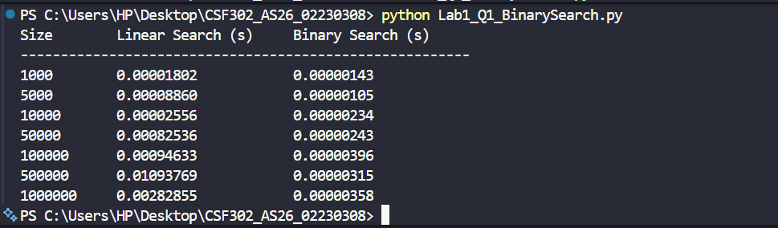
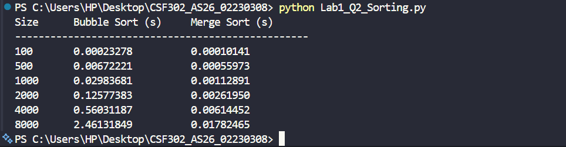
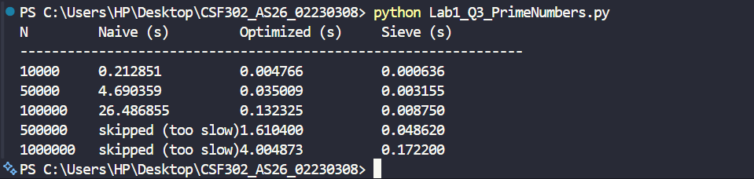

# Lab 1 – Algorithm Performance Analysis

---

## Question 1: Linear Search vs Binary Search

**File:** `Lab1_Q1_BinarySearch.py`

**Input Sizes Tested:** 1,000 / 5,000 / 10,000 / 50,000 / 100,000 / 500,000 / 1,000,000

**Screenshot of Output:**

---

## Question 2: Bubble Sort vs Merge Sort

**File:** `Lab1_Q2_Sorting.py`

**Input Sizes Tested:** 100 / 500 / 1,000 / 2,000 / 4,000 / 8,000

**Screenshot of Output:**

---

## Question 3: Prime Number Generation Methods

**File:** `Lab1_Q3_PrimeNumbers.py`

**Description:**
Naive Trial Division was skipped for N = 500,000 and N = 1,000,000 because it is O(n²) overall and would take an impractically long time to finish.

**Input Sizes Tested:** 10,000 / 50,000 / 100,000 / 500,000 / 1,000,000

**Screenshot of Output:**

